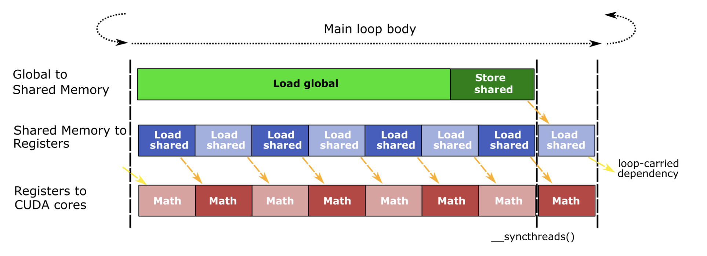

# LLM WORKLOAD

## Condition
- Llama3-8B Model (based on Huggingface)
- Input token 2048
- Output token 2048
- Batch size 8
- fp16 weight/activation
- NVIDIA A100 80GB PCIe
- 3rd gen. tensor core
- base clock : 1065 MHz
- boost clock : 1410 MHz
- 7 GPCs, 7 or 8 TPCs/GPC, 2 SMs/TPC, up to 16 SMs/GPC, 108 SMs
- 64 FP32 CUDA Cores/SM, 6912 FP32 CUDA Cores per GPU
- 4 Third-generation Tensor Cores/SM, 432 Third-generation Tensor Cores per GPU
- 5 HBM2 stacks, 10 512-bit Memory Controllers

## About Model Layer
- Decoder Layer


- KV Cache with Group Query Attention


## Environment
You need to install `PyTorch` because of `torch.Tensor` usages.
```
conda install pytorch::pytorch torchvision torchaudio -c pytorch
or
pip3 install torch torchvision torchaudio
```

```
$ python estimator.py

# visualize.py would make the roofline analysis image, but it's not easily readable..
$ python visualize.py
```

## Estimation
```bash
$ python estimator.py

---Flash Attention---
TTFT: 956.6947879034522 ms
TPOT: 10.290764998449612 ms
Latency: 22.032181504728257 s
Throughput: 92.95493501451435 token/s
```

```bash
# peak performance 614 TFLOPS
$ python estimator.py

---Flash Attention---
TTFT: 541.8848160945525 ms
TPOT: 10.290764998449612 ms
Latency: 21.617371532919357 s
Throughput: 94.73862244913843 token/s
```

## Tensor Core MMA (Matrix Multiplication and Accumulate) operation
- Each third-gen tensor core can perform 256 FP16 FMA per clock.
  - in PTX level, `mma.sync.m16n8k16` shape is supported
  - mma operation is converted to SASS (Hardware instructions of NVIDIA GPU) form, 2 HMMA instructions.
  - for perform 1 HMMA inst, it is estimated about 8 cycles.
  - for example, (batch, seq_len, hidden_dim) x (batch, hidden_dim, out_dim) GEMM case,
    - #HMMA: batch * seq_len * hidden_dim * out_dim / (16 * 8 * 16) 
    - #HMMA_PER_GPU: HMMA / TC_PER_SM / SM_PER_GPU  (4 tc per sm and 108 sm per gpu)
    - #HMMA_CYCLE: HMMA_PER_GPU * 8
    - estimated infer time: HMMA_CYCLE / GPU_CLOCK
- With asynchronous copy, computation can be overlapped with memory I/O
  - async copy, in PTX level, `cp.async` and `LDGSTS` in SASS.
  - with async copy, memory can be loaded to shared memory directly dram-(l2 bypass)-smem
  

- When the kernel is memory-bound, this pipeline would not be performed well
  

## Buffer Caching

- `L2 persistent cache` allows kernel to load data from l2 cache, not DRAM.
- L2 bandwidth is about 3.8TB/s and dram bandwidth is 1.94 TB/s


## Reference
- [Future Scaling of Memory Hierarchy for Tensor Cores and Eliminating Redundant Shared Memory Traffic Using Inter-Warp Multicasting](https://ieeexplore.ieee.org/stamp/stamp.jsp?arnumber=9893362)
- [Flash Attention v2](https://arxiv.org/abs/2307.08691)
- [NVIDIA A100 Tensor Core GPU Architecture](https://images.nvidia.com/aem-dam/en-zz/Solutions/data-center/nvidia-ampere-architecture-whitepaper.pdf)
- [DEVELOPING CUDA KERNELS TO PUSH TENSOR CORES TO THE ABSOLUTE LIMIT ON NVIDIA A100](https://developer.download.nvidia.com/video/gputechconf/gtc/2020/presentations/s21745-developing-cuda-kernels-to-push-tensor-cores-to-the-absolute-limit-on-nvidia-a100.pdf)
